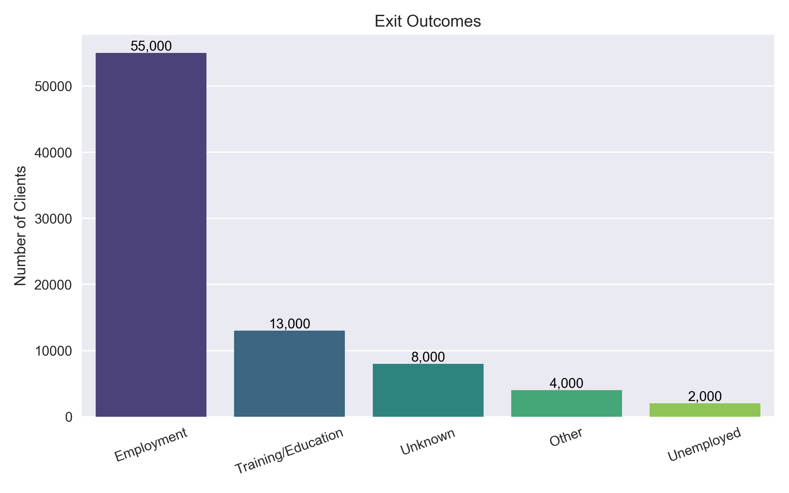

# Employment Services Client Outcomes – FY 2022–23 Analysis in Python 



---

## 📊 Overview
This project analyzes the **Employment Services (ES) Client Outcomes** dataset for the **2022–23 fiscal year**, covering 258 service delivery sites (SDS) across Ontario.  
The goal is to evaluate program effectiveness through **descriptive and inferential statistics**, focusing on employment at program exit and follow-up outcomes at 3 months.

The analysis is conducted in **Python (Jupyter Notebook)** using `pandas`, `matplotlib`, `seaborn`, and `scikit-learn`.

---

## 🧩 Objectives
- Explore and describe the dataset using appropriate descriptive statistics.
- Perform univariate, bivariate, and multivariate analyses.
- Identify key patterns and potential data quality issues.
- Test whether **employment at exit** predicts **employment at 3 months**.
- Generate actionable insights for program evaluation and policy decisions.

---
## 🔍 Key Steps in the Analysis
The project follows a structured pipeline:

```mermaid
graph LR
A[Load Data] --> B[Inspection]
B --> C[Cleaning]
C --> D[Summary Statistics]
D --> E[Regression Modeling]
